## Inspiration

OpenSea is always our biggest inspiration, the way it effectively built a potential platform for creators, investors, and traders is what made us to take a step ahead and create OpenOcean, an NFT Marketpalce built on Near.

Our Mission behind OpenOcean is to provide the best User experience we could ever. In the process, we could able to deliver the pretties NFT marketplace that you could ever find on the internet, and we’re proudly presenting that we’re only on Near at the moment.

The Design track in the prize list is also a catalyst that could help make our mission become reality.

## What it does:

OpenOcean can do:

- Minting an NFT by the user
- Buy an NFT
- Sell an NFT
- Create an Auction (dev stage)
- Bid an NFT (early stage)
- Profile holding, purchases of the user
- List all NFTs available to buy.

## How we built it:

Absolute React Js

## Challenges we ran into:

Fetching the data presenting was an ad-hoc to the development
Minting an NFT with near rest API was intimidating and prone to failures at first

## Accomplishments that we’re proud of:

We could able to do this, and we did our best
Providing the best UI that we could, getting inspired by various sources on the internet

## What we learned:

A drop in the ocean of NFT

## What’s next for OpenOcean:

Integrating OpenOcean with various wallets
Adding much more user customization
Tweaking the business model by offering royalties to the creators

## Installation

#### If you don't have Rust

Install Rust https://rustup.rs/

#### If you have never used near-cli

1. Install near-cli: `npm i -g near-cli`
2. Create testnet account: [Wallet](https://wallet.testnet.near.org)
3. Login: `near login`

#### Installing and Running Tests

1. Install everything: `yarn or npm i`
2. Deploy the contract and run the app tests: `yarn test:deploy`
3. Run the app : `yarn start or npm run start`

### Don't forget to install the wasm32 target:

`rustup target add wasm32-unknown-unknown`

Also recommend installing near-cli globally

`npm i -g near-cli`

## Screenshots:

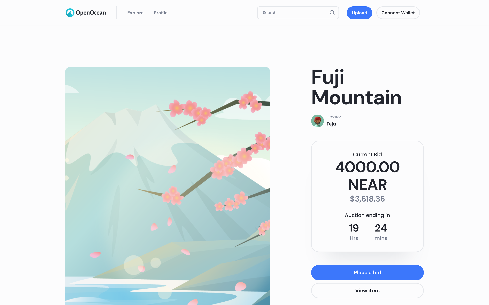
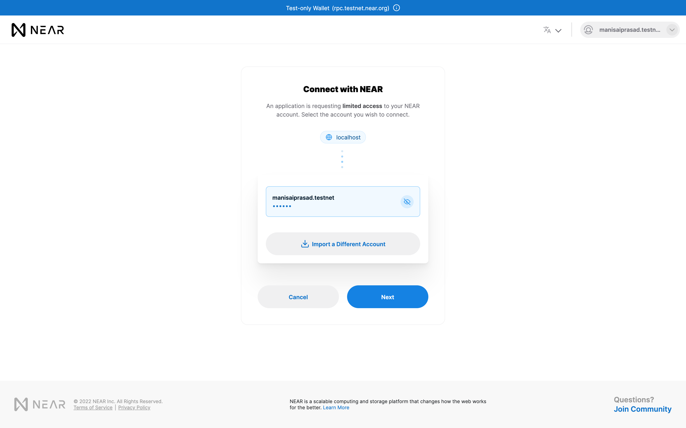
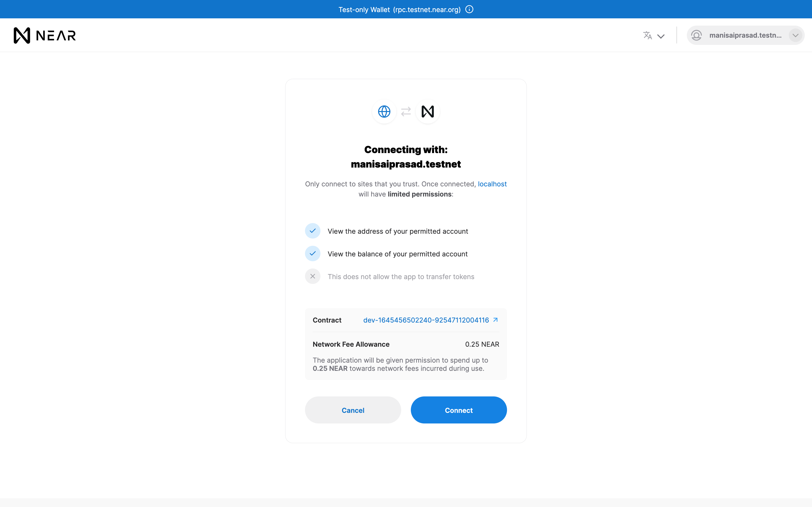
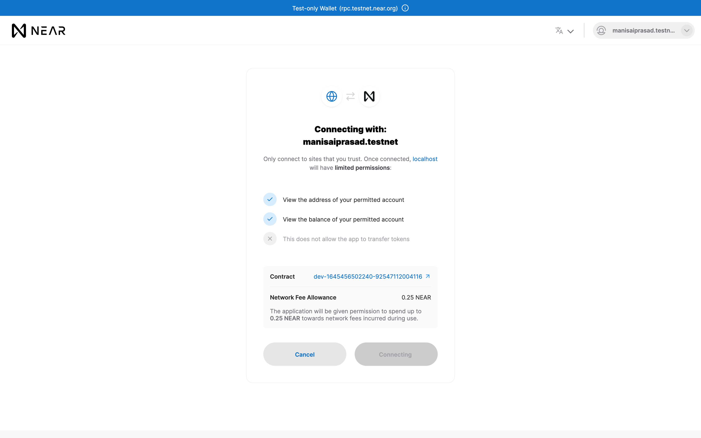
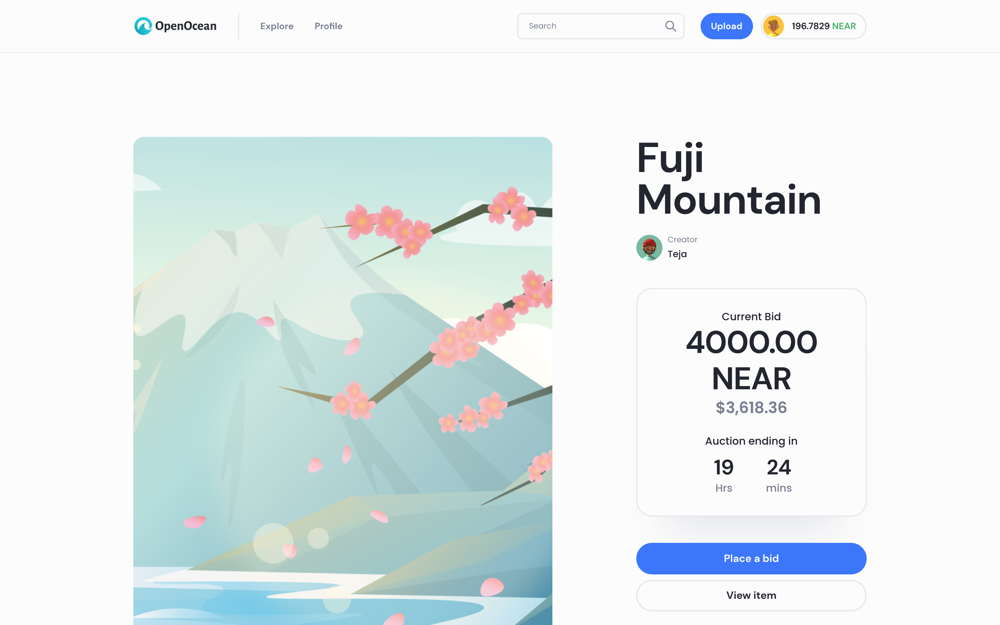
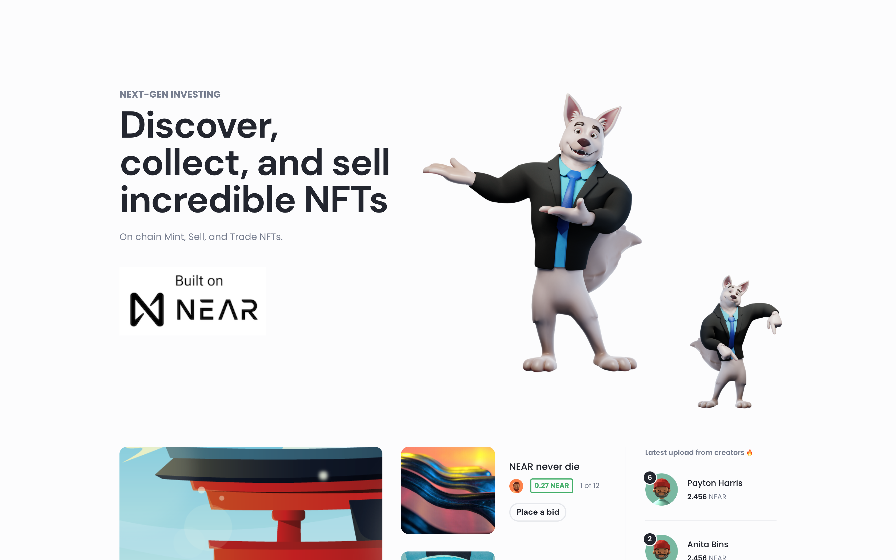
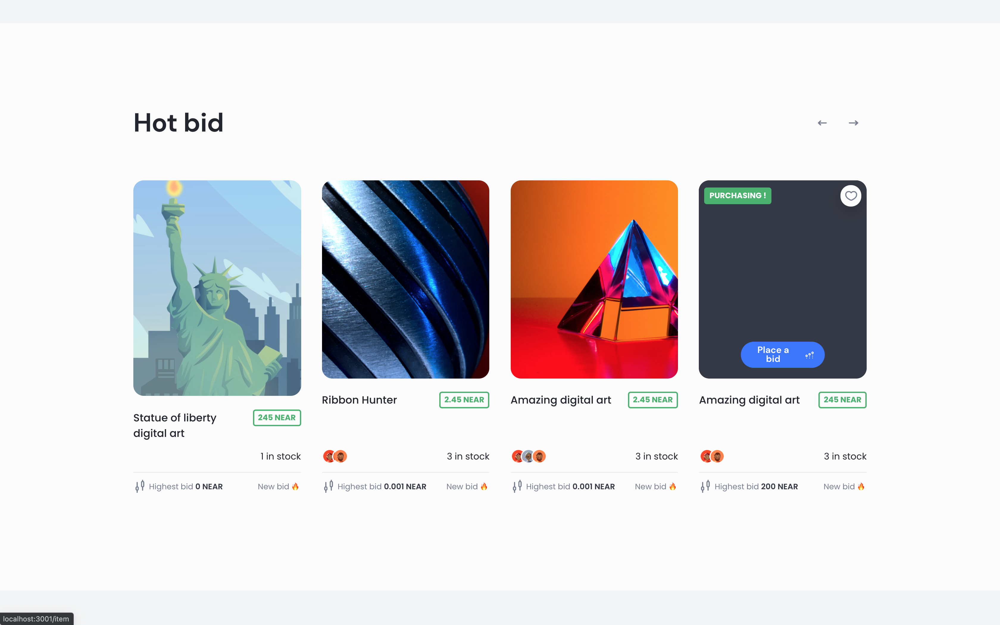
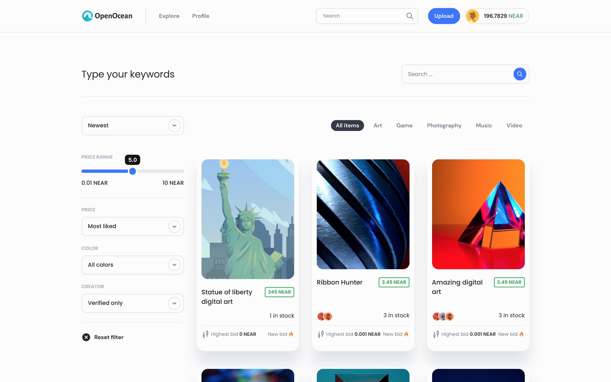

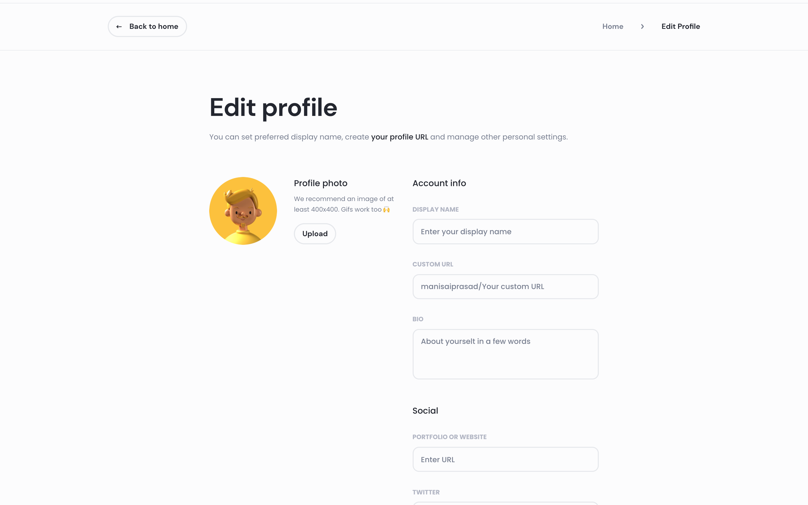
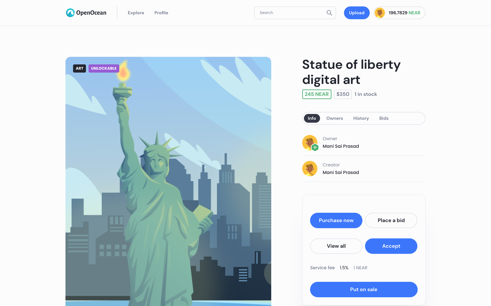
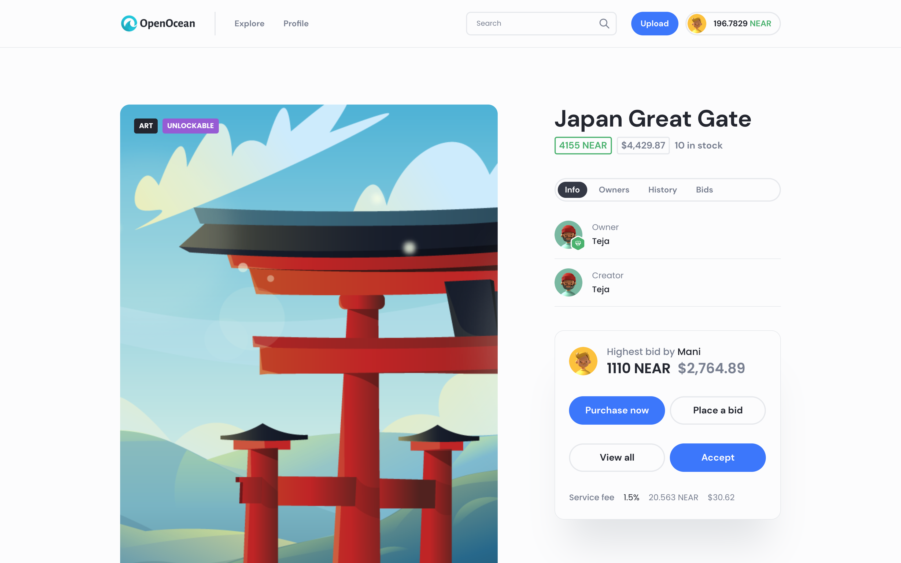
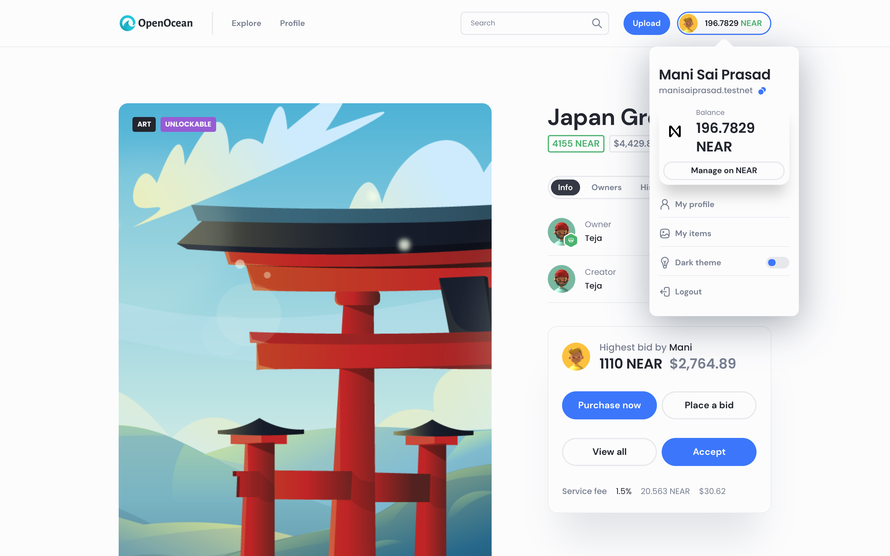
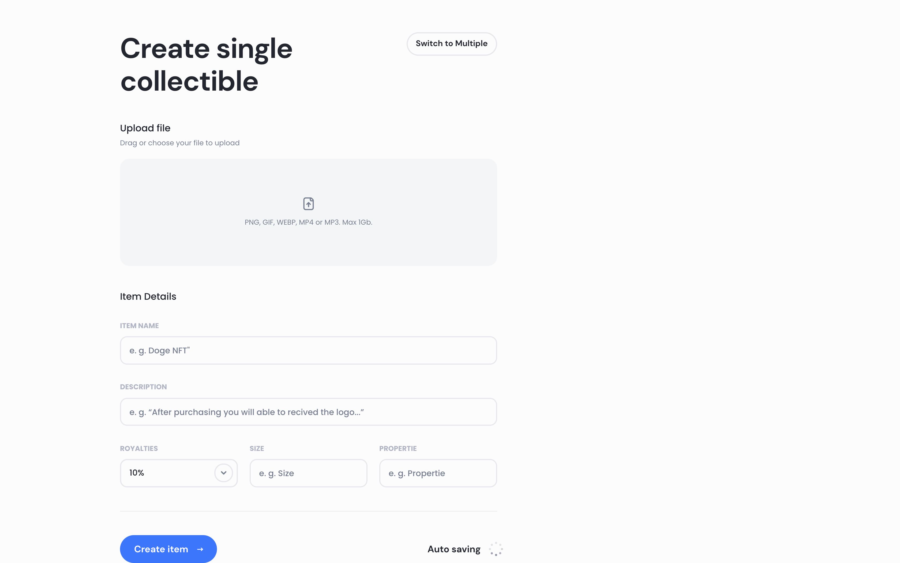
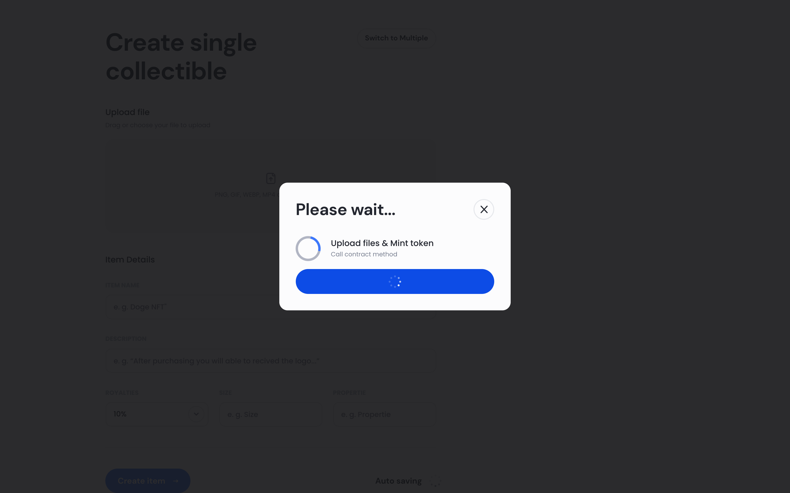
